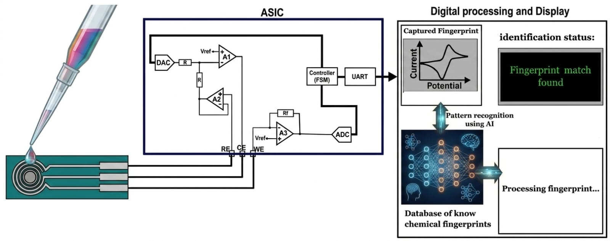

## Track: B  Team: B14 MX_UPP_INAOE  Project: ElectroChemID

| Discord | Github | Affiliation (experience) | Role |
|---|---|---|---|
| lcas_56805 | @lucaalsi | INAOE (post-graduate) | Team lead, System integration |
| vidal07.02_57039 | @VidalArroyo19 | Universidad Politécnica de Puebla (undergrad) | Amplifier desing |
| erickcastanon_11339 | @erickcast369 | Universidad Politécnica de Puebla (undergrad) | Digital design |
| robertocuauhtemoc | @RobertoCuauhtemoc | Universidad Politécnica de Puebla (undergrad) | ADC design |
| mariana09_12 | @marianaromero12 | Universidad Politécnica de Puebla (undergrad) | DAC design |
| dclementel_00 | @DClementeL | InnovaBienestar de México (post-graduate) | Digital design, System integration |

Overview: An Open-Source Integrated Potentiostat for AI-Driven Electrochemical Fingerprinting and Sample Identification.

## Quick Links

Team lead's repo: https://github.com/lucaalsi/B14-MX_UPP_INAOE

[Proposal Slide](https://docs.google.com/presentation/d/14xknRmG7m8jUdFvSzHqfR4pjAhqFaHPP/edit?usp=sharing&ouid=112671528064079631620&rtpof=true&sd=true)

## What is electrochem id?

ElectroChemID proposes the design, implementation, and validation of a low-cost potentiostat ASIC,developed using 
open-source microelectronics tools. The system is oriented toward the acquisition of cyclic voltammetry signals 
using commercial screen-printed electrodes (SPE), commonly used in laboratories for their affordable cost, 
portability, and standard three-electrode configuration (WE, CE, RE).

## Context 

Conventional electrochemical sensors are designed to detect a single specific molecule using biorecognition elements
such as enzymes, antibodies, or functionalized materials. This approach, although precise, involves an enormous cost:
it requires developing a completely different sensor for each application. Development times are extended, 
manufacturing costs scale up, and the system's scalability is limited to what it was originally designed for.

The project demonstrates that a simplified architecture based on moderate-resolution DAC and ADC converters (8 bits) 
is capable of capturing electrochemical fingerprints characteristic of different substances through cyclic voltametry. The acquired signals contain sufficient discriminative information to enable sample classification an characterization using artificial intelligence algorithms, even when obtained with an integrated potensiostat of simplified architecture and moderate resolution.

The project does NOT aim to compete with high-precision laboratory instrumentation. Its success is measured by the 
ability to capture sufficient electrochemical information for classification tasks, not by the accuracy in the 
quantification of specific analytes.

## Hypotesis

The proposal is based on previous research on electrochemical fingerprinting and electronic tongues, which have demonstrated that the overall electrochemical response of a sample contains sufficient information to differentiate foods, beverages, industrial fluids, and agricultural products without the need for specific biosensors or advanced chemical functionalization. However, most of the reported works focus on specific applications and employ laboratory instrumentation. ElectroChemID seeks to shift this paradigm toward an open platform based on integrated circuits and low-cost hardware.

## General Objetive

Design, implement, and validate a potentiostat integrated circuit using open-source tools that allows the acquisition of electrochemical fingerprints thru cyclic voltammetry and demonstrates its utility for AI-assisted classification tasks.

## Specfic Objetives

1. Design an integrated potentiostat using open-source tools for integrated circuit design. Design an integrated potentiostat using open-source tools for integrated circuit design.
2. Implement an architecture based on DAC and ADC of moderate resolution for the generation and acquisition of voltammetric signals. Implement an architecture based on DAC and ADC with moderate resolution for the generation and acquisition of voltammetric signals.
3. Integrate the system with commercial screen-printed electrodes (once the chip is manufactured). Integrate the system with commercial screen-printed electrodes (once the chip is manufactured).
5. Implement machine learning algorithms for sample classification (once the chip is manufactured). Implement machine learning algorithms for sample classification (once the chip is manufactured).
6. Validate experimentally the system's ability to distinguish different types of substances (once the chip is manufactured). Experimentally validate the system's ability to distinguish different types of substances (once the chip is manufactured).
7. Demonstrate that a simplified and accessible integrated circuit architecture can enable electrochemical fingerprinting without relying on laboratory-grade instrumentation.

## Block diagram

## Status

|Block|Schematic|Simulation|Layout|LVS|
|-----|---------|----------|------|---|
|OPAMP (A1:A3)|✅|  ✅    |  ⏳  |⏳|
|BIAS |   ✅    |   ✅    |  ⏳  |⏳|
|POTENCIOSTAT|✅|   ✅    |  ⏳  |⏳|
|COMPARATOR| ✅ |   ✅    |  ⏳  |⏳|
|DAC  |   ✅    |   ✅    |  ⏳  |⏳|
|ADC  |   ✅    |   ✅    |  ⏳  |⏳|
|UART |   ⏳    |   ⏳    |  ⏳  |⏳|
